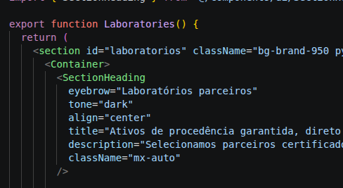
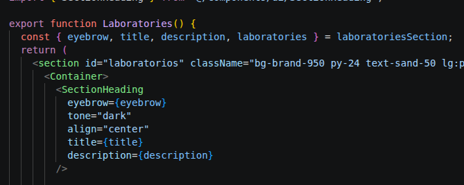
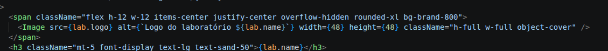
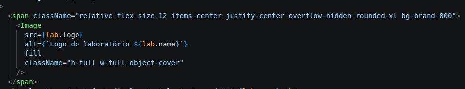

# Refatorações e Correções — `Laboratories.tsx`

O componente `Laboratories` é responsável por renderizar a seção que apresenta os laboratórios parceiros da farmácia.

Apesar do componente estar bem escrito e funcional, foram identificados alguns pontos de melhoria que também estavam presentes nas seções anteriores. Foram eles:

- Parte do conteúdo da seção estava escrito no componente, especificamente o conteúdo do cabeçalho.
- Os cards possuíam um efeito backdrop-blur que não era visível.
- As classes que estilizavam o tamanho do `span` que continha as logos dos laboratórios e do ícone `ArrowUpRight` podiam ser simplificadas
- O `span` que envolvia a `Image` que renderizava as logos dos laboratórios poderia ser usado para definir o tamanho da imagem

## Extração do conteúdo para `src/data/laboratories.ts`

Seguindo as alterações feitas nas seções anteriores, todo o conteúdo foi extraído do componente para uma constante, embora as informações sobre os laboratórios já estivessem em `laboratories`.

Antes

Depois

Além de melhorar a legibilidade, essa alteração preparou o componente para uma futura integração com CMS.

## Efeito backdrop-blur sem efeito visual

Como o fundo da seção era simplesmente uma cor sólida, o efeito que deveria dar uma sensação de vidro fosco não era visível, portanto foi removido.

## Simplificação das classes

Antes, o elemento que renderizava as logos e o componente `ArrowUpRight` eram estilizados com `h-` e `w-`, portanto essa estilização foi simplificada para `size-`.

## Responsabilidade pela definição do tamanho das logos

Anteriormente, o tamanho das logos era definido pelas propriedades `height` e `width` de `Image`, porém o `span` que envolvia a imagem já possuía tamanho fixo. Por isso foi possível fazer com que o `Image` preenchesse o espaço definido pelo elemento pai utilizando a propriedade `fill`.

Antes

Depois

As propriedades `height` e `width` foram substituídas por `fill`, fazendo com que o `Image` preencha o elemento pai. Para que o `fill` funcione corretamente, a classe `relative` também foi adicionada ao `span`, permitindo que o tamanho e o posicionamento da imagem sejam determinados em relação a esse elemento.
